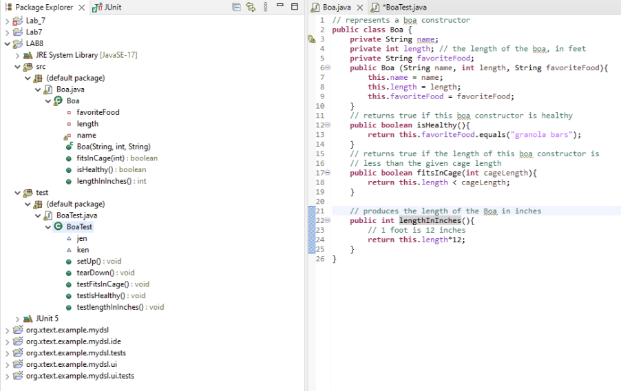
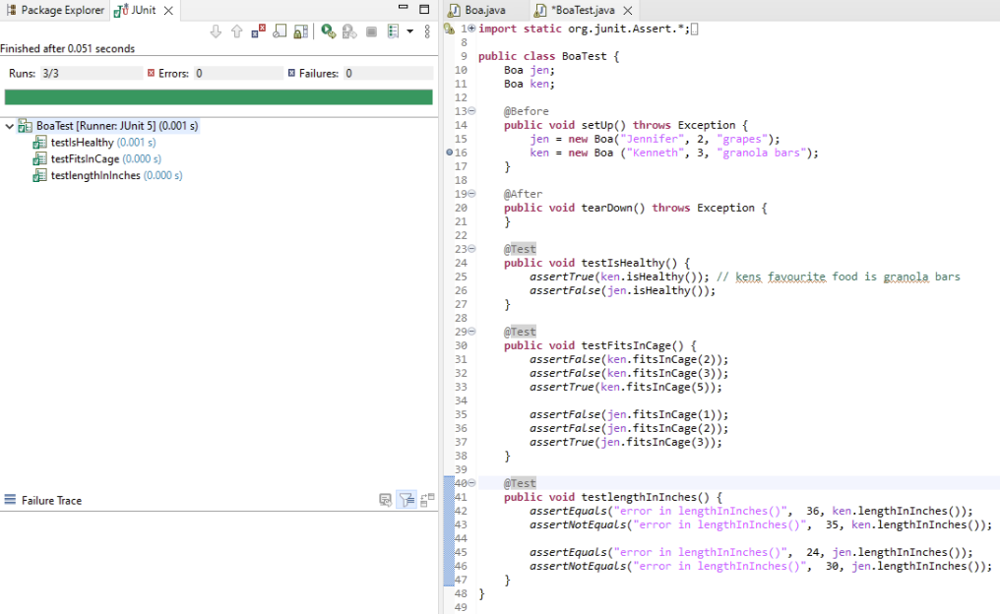

# Name : Jil Jagdishkumar Majiwala
# ID : 202001230
# Lab : 8

## 1. Creating a new Eclipse project, and within the project create a package and defining the class as mentioned in PDF.


### 2. Test method to test the behaviour of the Boa class : 
```
import org.junit.Assert;
import org.junit.Test;
public class BoaTest {
  @Test
  public void testIsHealthy() {
    Boa healthyBoa = new Boa("Lucy", 8, "granola bars");
    Assert.assertTrue(healthyBoa.isHealthy());
    
    Boa sickBoa = new Boa("Sneaky", 6, "mice");
    Assert.assertFalse(sickBoa.isHealthy());
  }
  @Test
  public void testFitsInCage() {
    Boa smallBoa = new Boa("Tiny", 2, "rats");
    Assert.assertTrue(smallBoa.fitsInCage(5));
    Assert.assertFalse(smallBoa.fitsInCage(1));
    Boa largeBoa = new Boa("Goliath", 20, "chicken");
    Assert.assertTrue(largeBoa.fitsInCage(25));
    Assert.assertFalse(largeBoa.fitsInCage(10));
  }
}
```

</br>

### 3. Modified setUp() method in the BoaTest class : 
```
public class BoaTest {
    private Boa jen;
    private Boa ken;
    
    @Before
    public void setUp() throws Exception {
        jen = new Boa("Jennifer", 2, "grapes");
        ken = new Boa("Kenneth", 3, "granola bars");
    }
    
    // write test methods here
}
```

</br>

### 4. Modified testIsHealthy() method in the BoaTest class : 
```
@Test
public void testIsHealthy() {
    // check that jen is not healthy
    assertFalse(jen.isHealthy());
    
    // check that ken is healthy
    assertTrue(ken.isHealthy());
}
```
</br>

### 5. Modified testFitsInCage() method in the BoaTest class : 
```
@Test
public void testFitsInCage() {
    // Test for jen
    assertFalse(jen.fitsInCage(1)); // cage length is less than length of boa
    assertTrue(jen.fitsInCage(2)); // cage length is equal to length of boa
    assertTrue(jen.fitsInCage(3)); // cage length is greater than length of boa
    // Test for ken
    assertFalse(ken.fitsInCage(2)); // cage length is less than length of boa
    assertTrue(ken.fitsInCage(3)); // cage length is equal to length of boa
    assertTrue(ken.fitsInCage(4)); // cage length is greater than length of boa
}
```
</br>

### 6. Running test cases :


